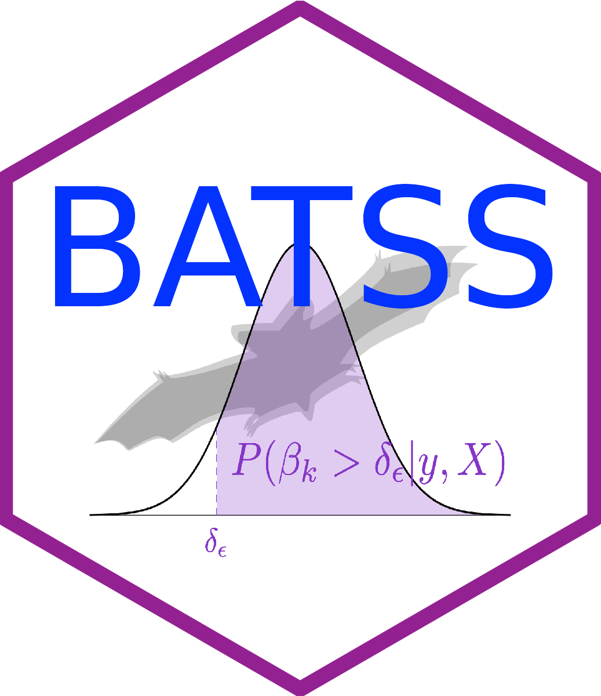

# 'BATSS' R package 

<h2>Package description</h2> 

BATSS - Bayesian Adaptive Trials Simulator Software - provides a flexible structure for the fast simulation of Bayesian adaptive designs for clinical trials. 

This package can be used to define and evaluate the operating characteristics of Bayesian adaptive designs for various different types of primary outcomes (e.g., those that follow a normal, binary, Poisson or negative binomial distribution) and can incorporate the most common types of adaptations: stopping treatments (or the entire trial) for efficacy or futility, and Bayesian response adaptive randomisation - based on user-defined adaptation rules. 

Other important features of this highly modular package include: parallel processing, customisability, use on a cluster computer or PC/Mac, and adjustment for covariates.

<h2>Installation instructions</h2> 

INLA needs to be installed prior to installing BATSS. For instructions, visit https://www.r-inla.org/download-install

To install the BATSS package from CRAN, run

```r
install.packages("BATSS")
```


To install the development version of the BATSS package from GitHub, run

```r
install.packages("devtools")
devtools::install_github("batss-dev/BATSS")
```


